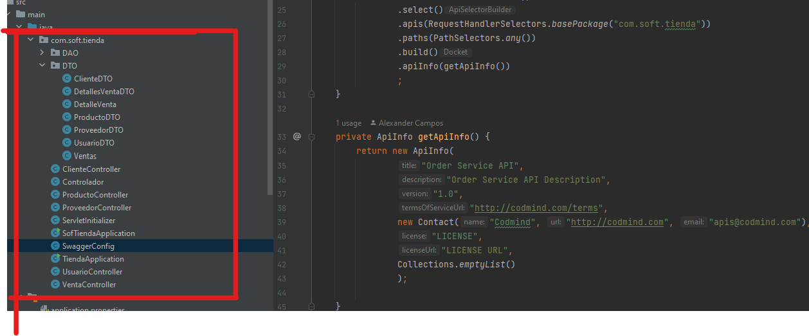

# 01 Refactoring + Code Smells

## Problema 1 (Codigo Quemado)

Existe una configuracion para la conexion de base de datos, directamente escrita dentro del codigo. Este ocasiona dos problemas :

1. Estamos creando vulnerabilidades en la seguridad de la aplicacion, ya que estamos dejando configuraciones que pueden ser sensibles explicitamente en el codigo, si alguien accede a la DB con las credenciales que se encuentran en codigo puede causar males peores
2. Problemas en el ciclo de vida del desarrollo del software, ya que en caso que querramos pasar de un ambiente de desarrollo  a uno de pre-produccion, debemos de recompilar todo el proyecto para actualizar dichas conexiones

```java
public class Conexion {
	
	
	static String bd = "tienda";
	static String login = "root";
	static String password = "";
	static String url = "jdbc:mysql://localhost:3306/"+bd;
	
	Connection connection = null;
	
	public Conexion(){
		try {
			
			Class.forName("com.mysql.cj.jdbc.Driver");
			//obtenemos la conexión
			connection = DriverManager.getConnection(url, login, password);
			
			if(connection!=null) {
				System.out.println("Conexión Exitosa a la Base de Datos "+bd+"\n");;
			}else {
				System.out.println("No se puedo conectar a la base de datos "+bd+"\n");
			}
		} catch (SQLException e) {
			System.out.println(e);
		} catch(ClassNotFoundException e) {
			System.out.println(e);
		} catch(Exception e) {
			System.out.println(e);
	}
```

### Aproximación de refactor

Como refactor se propone volver parametrizable dichas configuraciones, por medio el archivo application.properties y así eliminar dicha clase conexión, además de esto para no mostrar información sensible dentro del repositorio se propone el uso de variables de entorno/

```java
server.port=${SERVER_PORT}
spring.datasource.url=${DB_URL}
spring.datasource.username=${DB_USERNAME}
spring.datasource.password=${DB_PASSWORD}
spring.datasource.driver-class-name=org.mariadb.jdbc.Driver
spring.jpa.database=MYSQL
spring.jpa.open-in-view=false
spring.jpa.show-sql=false
spring.jpa.properties.hibernate.format_sql=true
spring.jpa.defer-datasource-initialization=true
spring.jpa.hibernate.ddl-auto=update 
```


## Problema 2 (Monitoreo por medio de print's)

En mano del codigo anterior hay otro aspecto a tener en cuenta, claramente al momento de manejar y/o propagar excepcioones, es importante dejar cierta trazabilidad del mismo para tomar planes de accion, pero no es una buena practica realizarlo son el System.out.println

```java
if(connection!=null) {
    System.out.println("Conexión Exitosa a la Base de Datos "+bd+"\n");;
}else {
    System.out.println("No se puedo conectar a la base de datos "+bd+"\n");
}
```

### Aproximación de refactor
como refactor se propone utilizar, propiamente la clase logs ya que esta muestra un mejor detalle de lo que va ocurriendo en la aplicacion.

```java
private static final Logger LOGGER = LoggerFactory.getLogger(SomeClass.class);

y utilizar sus respectivos metodos para dejar una traza correcta

info(), error(), trace()
```


## Problema 3 existe una incorrecta delegación de responsabilidades en la clase y no uso de atracciones e interfaces

La capa de los controladores, están usando directamente la capa de persistencia, esto puede causar un problema, ya que si en un futuro se desea hacer un cambio de a una base de datos relacional a no relacional deben modificar el código y estaríamos violando el principio de cerrado a modificaciones y abierto a extensiones. 


```java
@RestController
public class ClienteController {
	@RequestMapping("/registrarCliente")
	public void registrarCliente(ClienteDTO clienteDto) {
		ClienteDAO clientDao = new ClienteDAO();
		clientDao.registrarCliente(clienteDto);
	}

```
### Aproximación de refactor

Se propondría crear una capa intermedia entre el controlador y la capa de persistencia, que implemente una interfaz con los métodos base del CRUD del objeto en cuestión, que permitiría a crear una nueva implementación según sea necesario, también me apoyaría de las inyecciones de dependencias que tiene Spring Boot, como lo es con la etiqueta @Autowired

```java
@RestController
public class ClienteController {
    @Autowired
    @Quailifier("userServiceNoSQL")
    private UserService userService;

	@RequestMapping("/addClient")
	public ResponseDTO addCLient(ClientDTO clientDto) {
		return userService.addCliente(clientDto);
    }
}


public interface UserService {
    ResponseDTO addCLient(ClientDTO clientDto);
} 

@Service("userServiceSQL")
public class userServiceSQL implements UserService{
    @Autowired
    private UserRepository sqlRepository;

    ResponseDTO addCLient(ClientDTO clientDto){
        Client client = mapper.map(clientDTO);
        sqlRepository.save();
        return ResponseDTO;

    }
} 


@Service("userServiceNoSQL")
public class userServiceNoSQL implements UserService{
    @Autowired
    private UserRepository noSqlRepository;

    ResponseDTO addCLient(ClientDTO clientDTO){
            Client client = mapper.map(clientDTO);
            noSqlRepository.save();
            return ResponseDTO;
    }
} 

```

## Problema 4 Codigo duplicado


El proyecto cuenta con dos instancias de código que da inicio a la aplicación. Realizan la misma función, pero se encuentra en dos clases diferentes, esto causa un problema de configuración, ya que Spring Boot no sabe cuál tomar para dar marcha a la aplicación.

Clase 01
```java
package com.soft.tienda;

import org.springframework.boot.SpringApplication;
import org.springframework.boot.autoconfigure.SpringBootApplication;

@SpringBootApplication
public class SofTiendaApplication {

	public static void main(String[] args) {
		SpringApplication.run(SofTiendaApplication.class, args);
	}

}
```


Clase 02
```java
package com.soft.tienda;

import org.springframework.boot.SpringApplication;
import org.springframework.boot.autoconfigure.SpringBootApplication;

@SpringBootApplication
public class TiendaApplication {

	public static void main(String[] args) {
		SpringApplication.run(TiendaApplication.class, args);
	}

}
```

### Aproximación de refactor

Eliminar todo codigo duplicado y más si esta causa que la aplicacion no inicie.

## Problema 5 capa de datos

no existe la capa da data bien definida con la cual la capa de persistencia se pueda guiar, ya que el sistema parte que ya existe en la db.

### Aproximación de refactor

## Problema 6  estrucutra del proyecto 


 Estructura del proyecto no se encuentra bien definida, ya que la mayoría de las clases se encuentran en un solo paquete 

<br/>

<br/>

### Aproximación de refactor

se propone la siguiente estrucutura

```
├───src
│   ├───main
│   │   ├───java
│   │   │   └───com
│   │   │       └───soft
│   │   │             └───tienda
│   │   │                   └───models
│   │   │                   ├───controllers
│   │   │                   ├───dto
│   │   │                   │   ├───request
│   │   │                   │   └───response
│   │   │                   ├───repositories
│   │   │                   └───services
│   │   └───resources
│   │       ├───static
│   │       └───templates

```