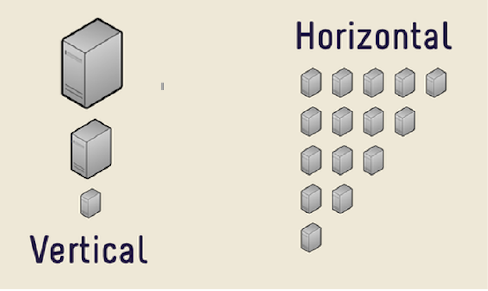
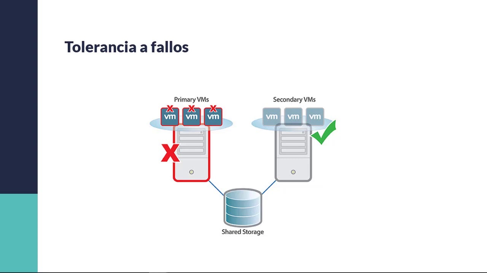
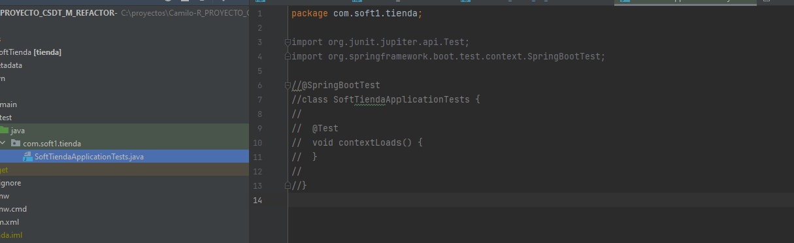

# 02 Clean Code + XP Practices

Analizar las características de Clean Code vistas en clase e indicar cuales de estas se están cumpliendo y argumentar,
de las que no se están cumpliendo indicar algunas recomendaciones

## Clean Code

### Cumplimiento de clean code

### No Cumplimiento de clean code

#### Aspecto 1: Problemas con la Escalabilidad

    El proyecto actualmente tiene cierta desventaja en temas de escalabilidad, ya que presenta una arquitectura monolítica, esto no quiere decir que el proyecto no pueda escalar, de lo contrario si puede escalar, pero debe manejar una <b>escalabilidad vertical</b> la cual significa que si el sistema se monta en  una máquina la única forma de escalarla es mejorar los recursos de la máquina, esto a la larga presentará un problema, ya que llegará a un límite en el cual la máquina no puede mejorarse más y se deberán utilizar otras técnicas de escalabilidad.

    Incluso se podría realizar una <b>escalabilidad horizontal</b>, pero al seguir teniendo una arquitectura monolítica (donde la aplicación es un todo)  puede llegar a ser desafiante, ya que si en esa nueva(s) instancia(s) que se monte(n) debe(n) de ser una réplica de toda la aplicación , incluso si solo necesitáramos crecer horizontalmente un servicio específico.

 

 

#### Aspecto 2: Problemas con mantener una alta disponibilidad de la misma

    Al igual que la escalabilidad, no significa que el proyecto no se pueda garantizar una disponibilidad, ya que pueden hacer el uso de servidores redundantes para poder mitigarlo, pero todos sabemos que si se tiene un servidor redundante y ambos servidores tienen recursos muy altos (para garantizar performance, disponibilidad) puede llegar a ser muy costoso, incluso si se distribuye la carga con balanceadores de carga, ya que al tener características altas siempre los costos se mantienen, (algo que no pasaría tal vez con funciones lambda o contenedores)

 

 

#### Aspecto 3: Problemas con la mantenibilidad y/o configuración del sistema

En este caso en el proyecto se ha encontrado que no esta diseñado, respecto a posibles cambios de configuracion que puede sufrir ya que la configuracion se encuentra definida en el mismo codigo, para todos los servicios que el sistema ofrece.

#### Propuesta para atacar aspectos 1,2,3 

##### Migracion de arquitectura monolitica a microservicios

Se propone realizar una migración de la arquitectura monolitica a una arquitectura de microservicios, con contextos propios de spring boot , para ir atacando cada uno de los aspectos antes mencionados:

1.  Eureka en Spring Boot: eureka es un componente que es utilizado como "servicio de descubrimiento de servicios", claramente al migrarnos de una arquitectura monolítica a micro servicios debemos preocuparnos de como vamos a comunicar los diferentes micro servicios de tal manera que no usemos malas prácticas en la implementación, como por ejemplo dejar URL quemadas dentro del código, para esto usamos una técnica de suscripción en el cual cada micro servicio, le notifica al servidor de eureka qué dirección tiene, causando que si un micro servicio necesitara otro le pregunta directamente al servidor de descubrimiento.
2.  Resilience4j: es un componente que se puede agregar a los micro servicios para poder atacar los errores de comunicacion y poder reaccionar a ellos, para esto este componente utiliza patrones como lo es Circuit breaker, todo configurable.
3.  Spring cloud gateway: relacionado con mantener una buena disponibilidad del servicio y a su vez una buena comunicación, este es un servidor el cual cuenta con balanceador de carga por debajo y es capaz de distribuir las diferentes peticiones, por medio del algoritmo Round Robin.
4.  Spring cloud condig: servidor el cual nos permitiria tener una configuracion centralizada, la cual es configurable segun el ambiente a trabajar

[Diagrama alto nivel de arquitectura propuesta](https://github.com/CSDT-ECI/Camilo-R_PROYECTO_CSDT_M_REFACTOR-/blob/master/images/01-DiagramaAltoNivelRefactor.png)

#### Aspecto 4: Testeable

El proyecto actualmente no cuenta con ningún tipo de pruebas, esto es un aspecto a revisar, ya que no hay forma de saber realmente, si nuestra aplicación está cumpliendo con los criterios de aceptación que debería cumplir, y solo nos daríamos cuenta cuando la aplicación ya esté desplegada en un ambiente productivo. 

 

 

#### Propuesta para atacar aspecto 4
Empezar a realizar las pruebas de cada uno de los servicios, para ir fomentando la deteccion temprana de errores

## Principios de Programación a revisar

Cuales principios de Programación no se están cumpliendo documentar sus conclusiones

## Practicas XP para mejorar

Cuales prácticas XP considera podrían utilizarse para mejorar la calidad del código