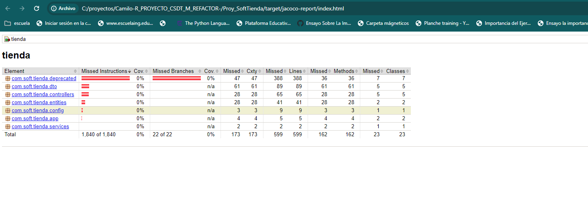
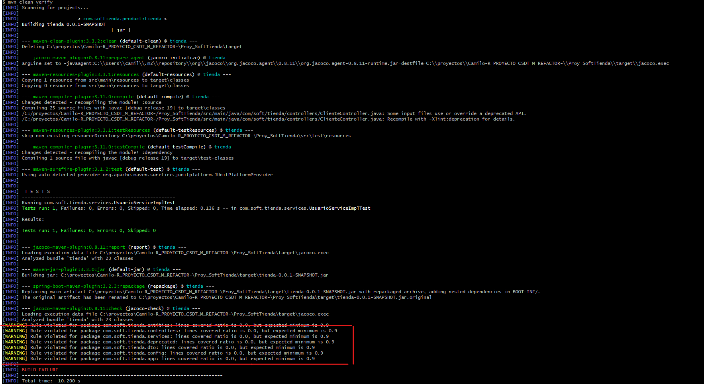

# 04 Testing Debt

1. Identificar en su proyecto cuales prácticas de Testing Debt se presentan y documentar con ejemplos si aplica

Para este caso en el proyecto, el proyecto no cuenta con algun tipo de test, por lo que cuenta con una deuda tecnica a nivel de pruebas muy alta 

```java
@SpringBootTest
class SoftTiendaApplicationTests {

	@Test
	void contextLoads() {
	}

}
```

2. Si no existen pruebas unitarias en su proyecto proponer algunas pruebas y si ya existen proponer algunos escenarios complementarios para garantizar un mayor cubrimiento (Coverage)

En esta parte realizaremos las pruebas de unidad utilizando la metodología de TDD, primero crearemos las pruebas para que estas fallen, luego iremos empezando el refactoring y lo ajustaremos para que nuestras pruebas empiecen a correr, se propone la siguiente estructura de pruebas


```tree
test
  └───java
      └───com
          └───soft
              └───tienda
                  ├───controllers
                  ├───repositories
                  └───services
```

pero antes de esto agregaremos las siguientes dependencias:

* Para poder saber cuanto es la cobertura de nuestro codigo utilizaremos jacoco
```xml
<!-- https://mvnrepository.com/artifact/org.jacoco/jacoco-maven-plugin -->
<dependency>
    <groupId>org.jacoco</groupId>
    <artifactId>jacoco-maven-plugin</artifactId>
    <version>0.8.11</version>
</dependency>


<!--y el siguiente plugin Jacoco embedded plugin. -->
<plugin>
<groupId>org.jacoco</groupId>
<artifactId>jacoco-maven-plugin</artifactId>
<version>0.8.11</version>
<executions>
    <execution>
        <id>jacoco-initialize</id>
        <goals>
            <goal>prepare-agent</goal>
        </goals>
    </execution>
    <execution>
        <id>report</id>
        <phase>test</phase>
        <goals>
            <goal>report</goal>
        </goals>
        <!-- default target/jscoco/site/* -->
        <configuration>
            <outputDirectory>target/jacoco-report</outputDirectory>
        </configuration>
    </execution>
    <!-- Add this checking -->
    <execution>
        <id>jacoco-check</id>
        <goals>
            <goal>check</goal>
        </goals>
        <configuration>
            <rules>
                <rule>
                    <element>PACKAGE</element>
                    <limits>
                        <limit>
                            <counter>LINE</counter>
                            <value>COVEREDRATIO</value>
                            <minimum>0.9</minimum>
                        </limit>
                    </limits>
                </rule>
            </rules>
        </configuration>
    </execution>
</executions>
</plugin>


<plugins>
<plugin>
    <groupId>org.springframework.boot</groupId>
    <artifactId>spring-boot-maven-plugin</artifactId>
    <configuration>
        <excludes>
            <exclude>
                <groupId>org.projectlombok</groupId>
                <artifactId>lombok</artifactId>
            </exclude>
        </excludes>
    </configuration>
</plugin>
</plugins>
```

* Para poder mockear o simular ciertos comportamientos, usaremos Mockito con la siguiente estructura
```java
@ExtendWith(MockitoExtension.class)
@TestInstance(TestInstance.Lifecycle.PER_CLASS)
class Test {

    @Mock
    private ObjectToMock objectToMock;

    @InjectMocks
    private ObjectToInjectMocks objectToInjectMocks;

    @Test
    void methodToTest() {
        // Arrange
        String someVariable = "someVariable";

        // Act
        when(objectToInjectMocks.methodToTest(anyString())).thenReturn(someResult);

        // Assert
        Assertions.assertThrows(Exception.class, () -> objectToInjectMocks.methodToTest(someVariable));
    }

}
```

* Dependencias para autogenerar código, en nuestro refactor como lo son lombok y JPA
```xml
<dependency>
    <groupId>org.springframework.boot</groupId>
    <artifactId>spring-boot-starter-data-jpa</artifactId>
</dependency>

<dependency>
    <groupId>org.mariadb.jdbc</groupId>
    <artifactId>mariadb-java-client</artifactId>
    <scope>runtime</scope>
</dependency>

<dependency>
    <groupId>org.projectlombok</groupId>
    <artifactId>lombok</artifactId>
    <optional>true</optional>
</dependency>

```

para correr las pruebas  del proyecto y a su vez saber cuál es su cobertura usaremos el siguiente comando.


```bash
mvn clean test
```

al entrar en la ruta 

```
target/jacoco-report/index.html 
```

veriamos algo del siguiente estilo

<br/>

<br/>

Una vez con la respectiva configuración, validamos que la cobertura esté en 0 y que al ejecutar la etapa de validación de pruebas nos falle al no tener la mínima cantidad esperada de cobertura, para esto ejecutaremos el siguiente comando

```bash
mvn clean verify
````

<br/>

<br/>

Prueba inicial para que falle, sin manejo de excepciones en la implementación capa de servicio,

para el método consultarUsuarioPorCorreoElectronico, tenemos 2 escenarios en caso de encontrar un usuario y retornar el usuario encontrado o, por lo contrario, no existir ninguno y lanzar una excepción


```java
@ExtendWith(MockitoExtension.class)
@TestInstance(TestInstance.Lifecycle.PER_CLASS)
class UsuarioServiceImplTest {

    @Mock
    private UserRespository userRespository;

    @InjectMocks
    private UsuarioServiceImpl usuarioService;

    @Test
    void consultarUsuarioPorCorreoElectronicoLanzaExcepcionPorNoExistirCorreo() {
        String correoDummy = "correo@falso.com";

        when(userRespository.obtenerUsuarioPorCorreo(anyString())).thenReturn(null);


        Assertions.assertThrows(UsuarioException.class, () -> usuarioService.consultarUsuarioPorCorreoElectronico(correoDummy));
    }

    @Test
    void consultarUsuarioPorCorreoElectronicoRetornaUsuario() {
        String correoDummy = "correo@falso.com";
        Usuario usuarioDummy = Mockito.mock(Usuario.class);

        when(userRespository.obtenerUsuarioPorCorreo(anyString())).thenReturn(usuarioDummy);

        Usuario usuarioObtenido = usuarioService.consultarUsuarioPorCorreoElectronico(correoDummy);

        assertEquals(usuarioDummy, usuarioObtenido);
    }
}
```


3. Proponer algunas mejoras o ideas para reducir la deuda  

empezamos haciendo refactor de los servicios CRUD, para esto empezaremos a usar el beneficio que brinda spring con la inyeccion de dependencias.

Implementacion anterior

```java

@RestController
public class UsuarioController {
	

	@RequestMapping("/consultarUsuario")
	public ArrayList<UsuarioDTO> consultarUsuario(long documento){
		UsuarioDAO userDao = new UsuarioDAO();
		return userDao.consultarUsuario(documento);
	}
	
	@RequestMapping("/listarUsuarios")
	public ArrayList<UsuarioDTO> listaDeUsuarios() {
		UsuarioDAO userDao = new UsuarioDAO();
		return userDao.listaDeUsuarios();
	}
}
```

actualizacion con inyeccion de dependencias, para que en pruebas se pueda realizar mockeos en esta capa se deberia retornar una respuesta JSON con su respectivo status y codigo descriptivo de la peticion 

Capa Controladores

```java
@RestController
public class UsuarioController {
    @Autowired
    private UsuarioService usuarioService;

	@RequestMapping("/consultarUsuario")
	public ResponseDTO consultarUsuario(String correo){
		
		return ResponseDTO.builder()
                .data(usuarioService.consultarUsuarioPorCorreoElectronico(correo))
                .status(HttpStatus.OK)
                .build();
	}
}
```

Capa servicios
```java
@Service
public class UsuarioServiceImpl implements UsuarioService {

    @Autowired
    private UserRespository userRespository;

    @Override
    public List<Usuario> consultarUsuarios() {
        return userRespository.findAll();
    }

    @Override
    public Usuario consultarUsuarioPorCorreoElectronico(String correo) {
        return Optional.ofNullable(userRespository.obtenerUsuarioPorCorreo(correo))
                .orElseThrow(() -> new UsuarioException("No existe un usuario registrado con el correo ".concat(correo)));
    }
}
```


