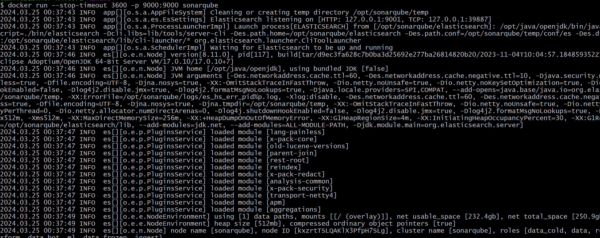
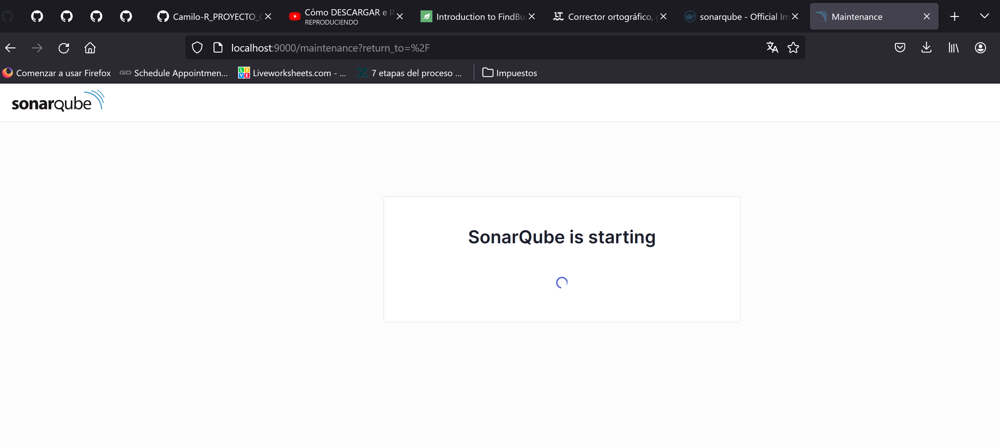
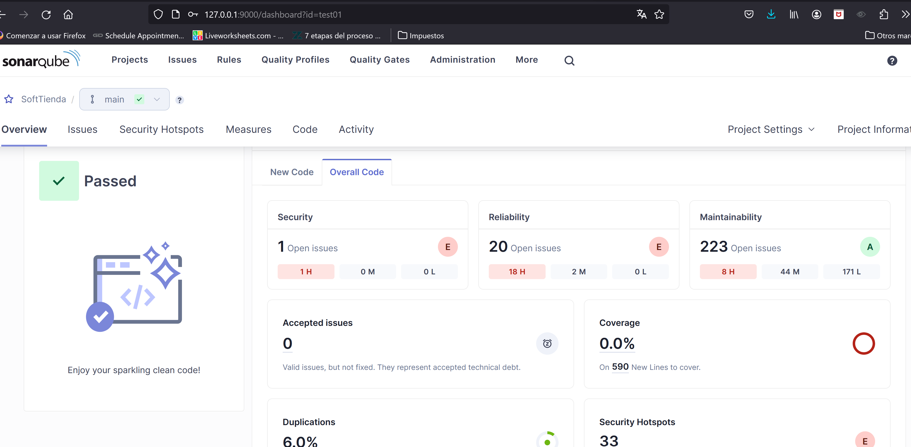

# Análisis de atributos de calidad sobre el proyecto

## Herramientas utilizadas

- SonnarInt

Esta es una herramienta utilizada para dar feedback inmediato en nuestro IDE mientras vamos escribiendo nuestro codigo,
nos permite a reducir temas antes de hacer commit.

para este caso agregamos el plugin de manera local en nuestro IDE, en este caso Intellij IDEA, configurandolo a un
servidor local de sonarqube

<br/>

<br/>

y procedemos a ejecutar para ver que recomendaciones nos lanza

## Resultados analisis

Dentro de los problemas que más se repiten en las recomendaciones.

- Tener codigos documentados y/o comentarios en el codigo, lo cual causa compilaciones innecesarias de codigo
- El uso de prints por medio de System.out en lugar de los logger, esto puede llegar a tener problemas de
  mantenibilidad, ya que los logs deben ser muy descriptivos y dicientes para poder hacer un monitoreo y correccion de
  manera rapida y efectiva.

<br/>

<br/>

- El no correcto o no existente manejo de las excepciones dentro de los controladores, puede llegar a ser utilizado como
  una vulnerabilidad que puede ser explotada por gente maliciosa para revelar informacion de la aplicacion o simplemente
  por medio de ataques DOS

<br/>

<br/>

- De mano con el anterior existen metodos que no mencionan como deberia comportarse el sistema al no encontrar un caso
  de uso, ejemplo
  <br/>
  
  <br/>
- Existe cierta logica en algunos condicionales que le agregan complejidad separandolos en varios condicionales, ya que
  en algunos casos el condicional siempre va a ser verdad, como en el caso que donde no se logre crear la conexion a la
  DB, simplemente entrara en el caso del catch , pero si nunca lanza excepcion la conexion nunca sera null
  <br/>
  
  <br/>

## Resultados analisis

## SonarCloud

Al no poder integrar Sonar Cloud con el repositorio por permisos de la organización, no logre configurar de manera
remota un servidor en sonnar cloud para crear un pipeline y automatizar las verificaciones de sonar en el proyecto al
hacer un push y/o pull request a master; sin embargo, se deja una plantilla del worflow mientras se soluciona el tema de
permisos para la integración, de momento para ver qué resultados se generaran, se corre un sonnar de manera local

### plantilla de work-flow

```yml
name: Build

on:
  push:
    branches:
      - main
      - entregaFinalPrimerCorte/STATIC_CODE_ANALYZER
    pull_request:
      types: [ opened, synchronize, reopened ]


jobs:
  build:
    name: Build
    runs-on: ubuntu-latest
    permissions: read-all
    steps:
      - uses: actions/checkout@v2
        with:
          fetch-depth: 0  # Shallow clones should be disabled for a better relevancy of analysis
      - name: Set up JDK 17
        uses: actions/setup-java@v1
        with:
          java-version: 17
      - name: Cache SonarQube packages
        uses: actions/cache@v1
        with:
          path: ~/.sonar/cache
          key: ${{ runner.os }}-sonar
          restore-keys: ${{ runner.os }}-sonar
      - name: Cache Maven packages
        uses: actions/cache@v1
        with:
          path: ~/.m2
          key: ${{ runner.os }}-m2-${{ hashFiles('**/pom.xml') }}
          restore-keys: ${{ runner.os }}-m2
      - name: Build and analyze
        env:
          SONAR_TOKEN: ${{ secrets.SONAR_TOKEN }}
          SONAR_HOST_URL: ${{ secrets.SONAR_HOST_URL }}
        run: mvn -B -f Proy_SoftTienda/pom.xml verify org.sonarsource.scanner.maven:sonar-maven-plugin:sonar -Dsonar.projectKey=test01 -Dsonar.projectName='SoftTienda' -Dsonar.host.url=http://localhost:9000 -Dsonar.token=${SONAR_TOKEN}
```

### Sonarqube con docker

para este caso nos basaremos en una imagen docker, que ya cuenta con el servidor de sonnar y la ejecutaremos de manera
local, para esto ejecutaremos el siguiente comando

```bash
docker pull sonarqube
docker run --stop-timeout 3600 -p 9000:9000 sonarqube 
```

verificamos que el contenedor subiera de manera correcta


   <br/>
   
   <br/>

abrimos de manera local en el puerto 9000


   <br/>
   
   <br/>


si queremos validar de manera local el reporte ejecutamos el comando

```bash
mvn clean verify sonar:sonar -Dsonar.projectKey=test01 -Dsonar.projectName='SoftTienda' -Dsonar.host.url=http://localhost:9000 -Dsonar.token=sqp_2b124e2c8943797d49a935638d9270f6e6d6f7d0
```

  <br/>
   
   <br/>


## Conclusiones

1. El reporte generado por sonar nos permitió encontrar que el proyecto principalmente en cuanto a la seguridad y el mantenimiento.
2. Este tipo de herramientas nos permiten realizar una detección temprana de problemas, relacionados con la calidad del código. Logrando que estos problemas no lleguen a avanzar mucho en el desarrollo de software y solo queden en la etapa de desarrollo
3. Este tipo de herramientas fomentan la mejora de prácticas de programación
4. En el caso de sonarqube, tiene diversos paneles, métricas y gráficas que permite de una manera muy visual entender que debemos mejorar dentro de nuestro código
5. Estas herramientas se pueden automatizar para que siempre Nos manden alertas en caso de que inyectemos problemas a nuestro código
