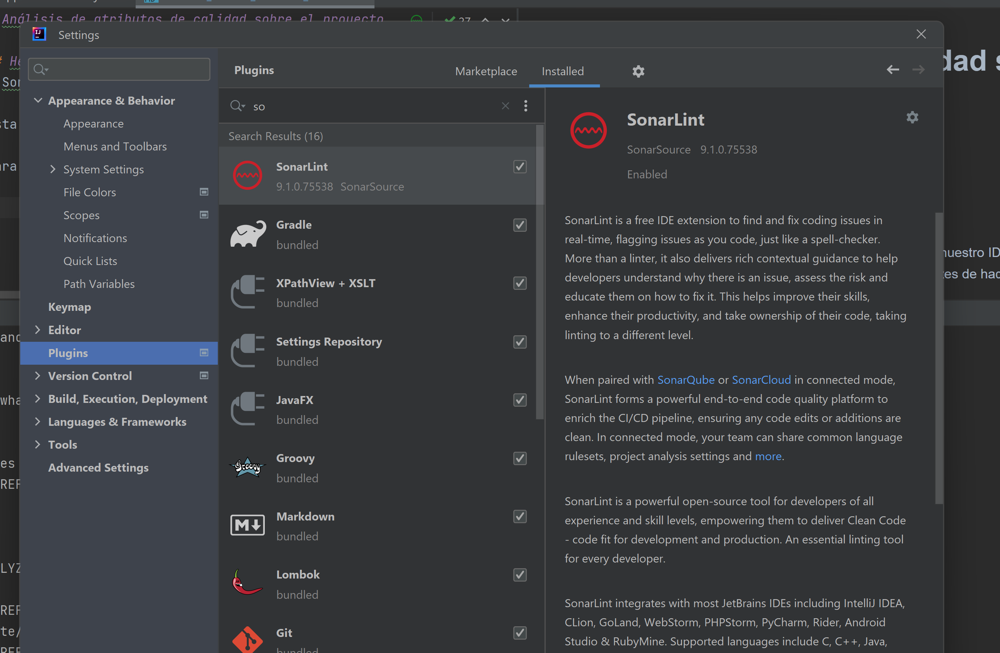
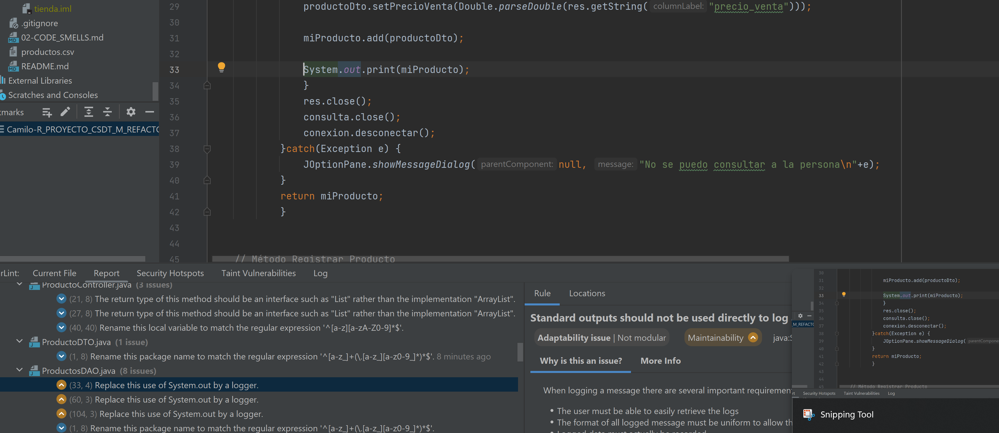
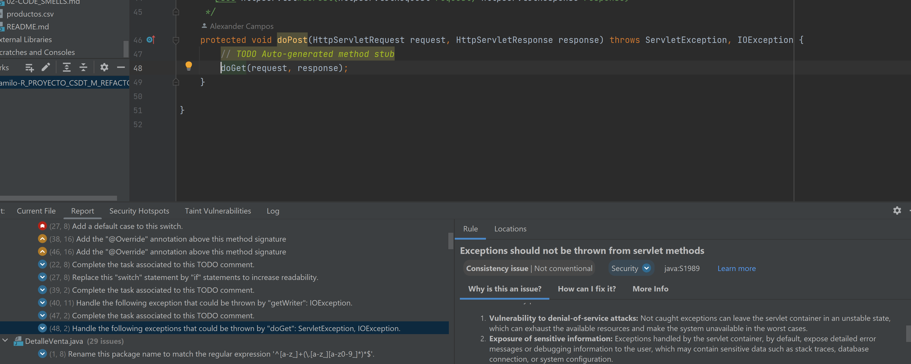
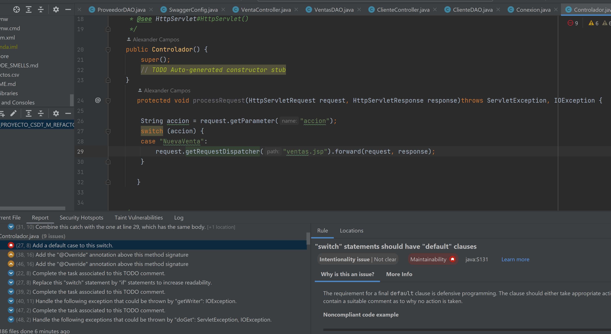
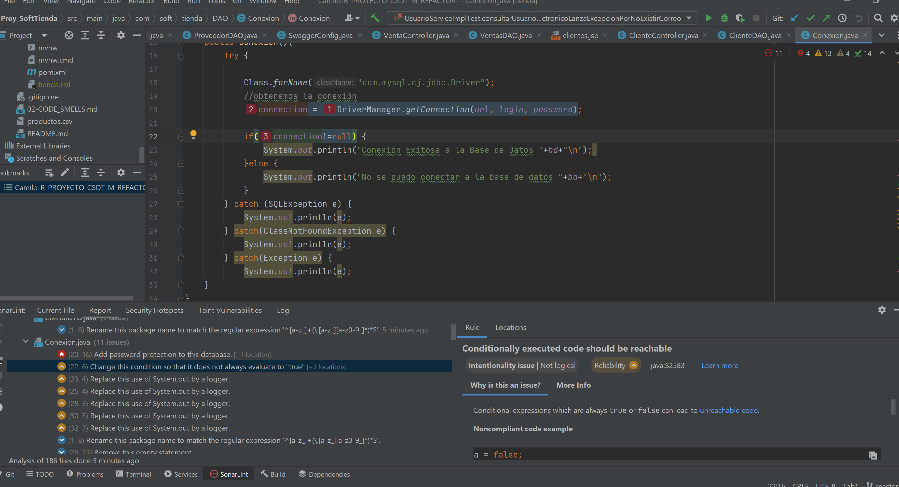

# Análisis de atributos de calidad sobre el proyecto

## Herramientas utilizadas 
- SonnarInt

Esta es una herramienta utilizada para dar feedback inmediato en nuestro IDE mientras vamos escribiendo nuestro codigo, nos permite a reducir temas antes de hacer commit.

para este caso agregamos el plugin de manera local en nuestro IDE, en este caso Intellij IDEA, configurandolo a un servidor local de sonarqube

<br/>

<br/>

y procedemos a ejecutar para ver que recomendaciones nos lanza


## Resultados analisis

Dentro de los problemas que más se repiten en las recomendaciones.

- Tener codigos documentados y/o comentarios en el codigo, lo cual causa compilaciones innecesarias de codigo 
- El uso de prints por medio de System.out  en lugar de los logger, esto puede llegar a tener problemas de mantenibilidad, ya que los logs deben ser muy descriptivos y dicientes para poder hacer un monitoreo y correccion de manera rapida y efectiva.

<br/>

<br/>

- El no correcto o no existente manejo de las excepciones dentro de los controladores, puede llegar a ser utilizado como una vulnerabilidad que puede ser explotada por gente maliciosa para revelar informacion de la aplicacion o simplemente por medio de ataques DOS


<br/>

<br/>

- De mano con el anterior existen metodos que no mencionan como deberia comportarse el sistema al no encontrar un caso de uso,  ejemplo
  <br/>
  
  <br/>
-  Existe cierta logica en algunos condicionales que le agregan complejidad separandolos en varios condicionales, ya que en algunos casos el condicional siempre va a ser verdad, como en el caso que donde no se logre crear la conexion a la DB, simplemente entrara en el caso del catch , pero si nunca lanza excepcion la conexion nunca sera null
   <br/>
   
   <br/>


## Resultados analisis 


## SonarCloud

Al no poder integrar Sonar Cloud con el repositorio por permisos de la organización, no logre configurar de manera remota un servidor en sonnar cloud para crear un pipeline y automatizar las verificaciones de sonar en el proyecto al hacer un push y/o pull request a master; sin embargo, se deja una plantilla del worflow mientras se soluciona el tema de permisos para la integración, de momento para ver qué resultados se generaran, se corre un sonnar de manera local

### plantilla de work-flow
```yml
# Feel free to take a look at our documentation (https://docs.sonarcloud.io/getting-started/github/)
# or reach out to our community forum if you need some help (https://community.sonarsource.com/c/help/sc/9)

name: SonarCloud analysis

on:
  push:
    branches: [ "master" ]
  pull_request:
    branches: [ "master" ]
  workflow_dispatch:

permissions:
  pull-requests: read # allows SonarCloud to decorate PRs with analysis results

jobs:
  Analysis:
    runs-on: ubuntu-latest

    steps:
      - name: Checkout repository
        uses: actions/checkout@v2
      - name: Set up JDK 17
        uses: actions/setup-java@v2
        with:
          java-version: '17'
      - name: Build with Maven
        run: mvn clean verify

      - name: Analyze with SonarCloud
        # You can pin the exact commit or the version.
        # uses: SonarSource/sonarcloud-github-action@de2e56b42aa84d0b1c5b622644ac17e505c9a049
        uses: SonarSource/sonarcloud-github-action@master
        env:
          GITHUB_TOKEN: ${{ secrets.GITHUB_TOKEN }}  # Needed to get PR information
          SONAR_TOKEN: ${{ secrets.SONAR_TOKEN }}   # Generate a token on Sonarcloud.io, add it to the secrets of this repo with the name SONAR_TOKEN (Settings > Secrets > Actions > add new repository secret)
```

### Sonarqube con docker

para este caso nos basaremos en una imagen docker, que ya cuenta con el servidor de sonnar y la ejecutaremos de manera local, para esto ejecutaremos el siguiente comando
```bash
docker pull sonarqube
docker run --stop-timeout 3600 -p 9000:9000 sonarqube 
```

verificamos que el contenedor subiera de manera correcta

abrimos de manera local en el puerto 9000

   <br/>
   
   <br/>

## Conclusiones


