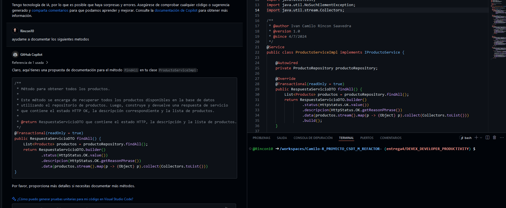
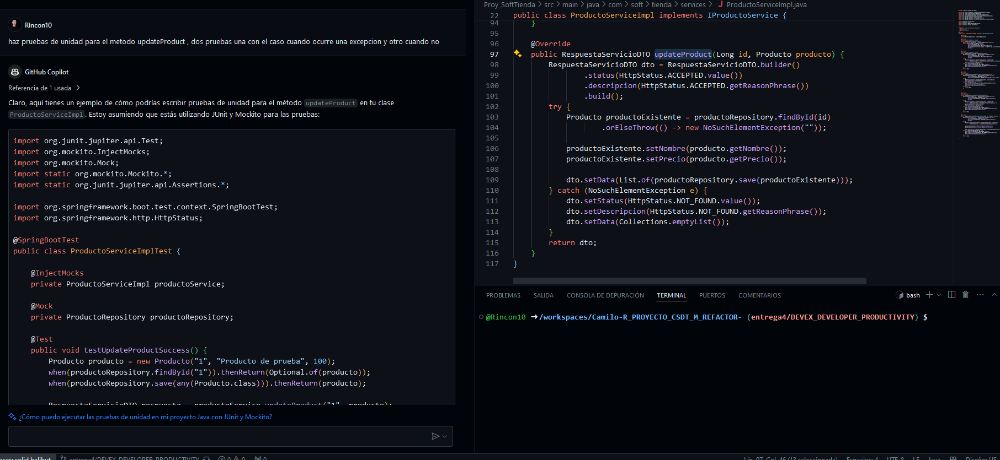

# DevEx + Developer Productivity

En esta sección, analizaremos como existen componentes y/o eventos que pueden llegar a afectar la productividad y experiencia del desarrollador, para esto haremos uso de un conjunto de conceptos, prácticas y criterios para enfocarnos en esta problemática, específicamente con los marcos de trabajo DevEx y SPACE.

Además de esto nos apoyaremos con el uso de herramientas desarrolladas con inteligencia artificial, esto para entender como estas nuevas tecnologías nos ayudan y permiten mejorar nuestra productividad a la hora de desarrollar software


## Entrega 
* Analizar el proyecto teniendo en cuenta las diferentes actividades que se han realizado e identificar puntos positivos o negativos con relación a la experiencia del desarrollador DevEx y la productividad (SPACE), documentar esto en la bitácora. Identificar oportunidades de mejora, algunas métricas identificables y lo que consideren importante con relación a los dos frameworks vistos en clase (DevEX + SPACE)

### Puntos Positivos

* Se hizo una actualizacion en las dependencias del proyecto, para que el proyecto no utilice una version de spring boot desactualizada y con vulnerabilidades, ademas esta actualizacion de dependecias nos permitira usar en la capa de seguridad programacion reactiva con web-flux, tolerancia a fallos y servicio de descubrimiento de servicios
* Se logró agregar un flujo de trabajo, para poder empezar a tener visibilidad de los despliegues al momento de integrar un feature a la rama productiva, ya que se estarán revisando temas como pruebas, calidad del código, cobertura y además con este tipo de workflows, nos permitirá ver otras métricas para analizar la productividad del proyecto, y que no se estén inyectando código no funcional o incluso que no compile
* Se ha ido migrando poco a poco la arquitectura monolitica a una arquitectura orientada a micro servicios, lo cual permitira a un futuro tener una mejor escalabilidad de la aplicacion.
* Migracion de manera sencilla de la configuracion del proyecto inicialmente a un archivo de propiedades, eliminando cualquier configuracion quemada en el codigo, esto mejora mucho la mantenibilidad del proyecto porque no seria necesario un despliegue adicional en caso de que una de las configuracion cambie en el proyecto

### Puntos Negativos

* El proyecto no cuenta con una documentación base y hay algunas clases donde sus declaraciones de variables, funciones y/o lógica no permitía tener claridad de lo que se estaba tratando de implementar


Como se puede observar en el siguiente ejemplo no encontramos documentación para la capa la clase VentasDao ni en el metodo, ya que como se puede observar este tiene un comentario el cual no nos funcionaría en caso de tener la necesidad de generar la documentación con javadoc,
además, si nos percatamos el método consecutivoFactura(), nos da a entender que consultaremos un consecutivo a asignar a la nueva factura, pero se podría renombrar a obtenerConsecutivoDisponibleParaFactura()

```java
public class VentasDAO {
	Connection connection;
	Conexion conexion = new Conexion();
	PreparedStatement ps;
	ResultSet rs;
	
	
	// Metodo para obtener el numero de factuta: codigo_venta
	public long consecutivoFactura() {
			long consecutivo = 0;
			String sql= "SELECT MAX(codigo_venta) FROM ventas";
			try {
				connection = conexion.getConnection();
				ps = connection.prepareStatement(sql);
	            rs = ps.executeQuery();
	            while (rs.next()) {
	                consecutivo = rs.getLong(1);
	                System.out.print(consecutivo);
			}} catch (SQLException e) {
				 System.out.print("No fue pósible traer el consecutivo de la factura");
			}
			return consecutivo;
		}
}

```

Este aspecto puede llegar a desmotivar al momento de desarrollar o refactorizar viejas/nuevas funcionalidades, ya que se debe ir pagando esa deuda técnica de documentación que existían el proyecto base, para esta y las demás clases,
si olvidar también que el proyecto tampoco cuenta con documentación a nivel del API expuesto, puesto que aunque tiene configurado swagger por defecto, esta no tiene descripción de los diferentes endpoints


* Al no tener pruebas unitarias o algún tipo de pruebas en el proyecto base, las cuales  nos permitan saber si el comportamiento del sistema es el esperado, empezar a pagar dicha deuda puede llegar a ser un poco des motivadora, ya que sería un trabajo adicional

* Cuando se empezó a revisar el proyecto por primera vez, fue muy difícil ver el estado del proyecto y qué calidad tenía este, ya que no contaba con herramientas de analis de código estático, ni de cobertura.


### Métricas a implementar

* Tasa de éxito de los despliegues
* Cobertura minima de pruebas 
* Tasa de errores de codigo (en un ambiente real, si notamos que reportamos muchas veces relacionados a un codigo, algo estamos haciendo mal)


### Inteligencia Artificial como herramienta

* Aplicar alguna herramienta AI para poder solucionar temas de malas prácticas en el desarrollo, documentación de código, entendimiento de código, implementación de pruebas unitarias, refactorización o lo que ustedes consideren. Hay muchas herramientas en el mercado, como mínimo utilizar GitHub Copilot o AWS CodeWhisperer  traten de explotar algunas de las características de este y documenten su beneficio y como mejora productividad y experiencia cuando se utilizan.


Para el uso de herramientas de inteligencia artificial usaremos Github Copilot,para apoyarnos en recomendaciones de refactor, ajustes en documentacion y desarrollo de pruebas de unidad, mencionando las Clases de equivalencia que se deben de tener en cuenta.  

### GitHub Copilot

empezaremos utilizando github copilot para generar pruebas de unidad y documentacion de los refactor que hemos venido haciendo, para empezar tomaremos como ejemplo la clase ProductoServiceImpl

```java
@Service
public class ProductoServiceImpl implements IProductoService {

    @Autowired
    private ProductoRepository productoRepository;

    @Override
    @Transactional(readOnly = true)
    public RespuestaServicioDTO findById(Long id) {
        RespuestaServicioDTO dto = RespuestaServicioDTO.builder()
                .status(HttpStatus.OK.value())
                .descripcion(HttpStatus.OK.getReasonPhrase())
                .build();
        try {
            Producto producto = productoRepository.findById(id)
                    .orElseThrow(() -> new NoSuchElementException("No se encontro el producto con id ".concat(id + "")));
            dto.setData(List.of(producto));
        } catch (NoSuchElementException e) {
            dto.setStatus(HttpStatus.NOT_FOUND.value());
            dto.setDescripcion(HttpStatus.NOT_FOUND.getReasonPhrase());
            dto.setData(Collections.emptyList());
        }
        return dto;
    }
}
```
abrimos nuestro codigo en un codeSpace y revisamos que tengamos la siguiente extension

<br/>

<br/>

solicitamos la documentacion para el metodo findAll

<br/>

<br/>

y obtenemos 
```java
/**
* Método para obtener todos los productos.
*
* Este método se encarga de recuperar todos los productos disponibles en la base de datos
* utilizando el repositorio de productos. Luego, construye y devuelve una respuesta de servicio
* que contiene el estado HTTP OK, la descripción correspondiente y la lista de productos.
*
* @return RespuestaServicioDTO que contiene el estado HTTP, la descripción y la lista de productos.
  */
  @Transactional(readOnly = true)
  public RespuestaServicioDTO findAll() {
      List<Producto> productos = productoRepository.findAll();
      return RespuestaServicioDTO.builder()
              .status(HttpStatus.OK.value())
              .descripcion(HttpStatus.OK.getReasonPhrase())
              .data(productos.stream().map(p -> (Object) p).collect(Collectors.toList()))
  }
```

otro ejemplo de generacion de documentacion con copilot


```java
/**
 * Método para obtener un producto por su ID.
 *
 * Este método intenta recuperar un producto de la base de datos utilizando su ID.
 * Si el producto se encuentra, se construye y devuelve una respuesta de servicio con el estado HTTP OK y el producto.
 * Si el producto no se encuentra, se construye y devuelve una respuesta de servicio con el estado HTTP NOT FOUND y una lista vacía.
 *
 * @param id El ID del producto a buscar.
 * @return RespuestaServicioDTO que contiene el estado HTTP, la descripción y el producto o una lista vacía.
 */
@Override
@Transactional(readOnly = true)
public RespuestaServicioDTO findById(Long id) {
    RespuestaServicioDTO dto = RespuestaServicioDTO.builder()
            .status(HttpStatus.OK.value())
            .descripcion(HttpStatus.OK.getReasonPhrase())
            .build();
    try {
        Producto producto = productoRepository.findById(id)
                .orElseThrow(() -> new NoSuchElementException("No se encontro el producto con id ".concat(id + "")));
        dto.setData(List.of(producto));
    } catch (NoSuchElementException e) {
        dto.setStatus(HttpStatus.NOT_FOUND.value());
        dto.setDescripcion(HttpStatus.NOT_FOUND.getReasonPhrase());
        dto.setData(Collections.emptyList());
    }
    return dto;
}

```

al final como resultado para ese crud obtenemos la siguiente documentacion

```java
package com.soft.tienda.services;


import com.soft.tienda.dto.response.RespuestaServicioDTO;
import com.soft.tienda.entities.Producto;

public interface IProductoService {
    /**
     * Método para obtener todos los productos.
     * <p>
     * Este método se encarga de recuperar todos los productos disponibles en la base de datos
     * utilizando el repositorio de productos. Luego, construye y devuelve una respuesta de servicio
     * que contiene el estado HTTP OK, la descripción correspondiente y la lista de productos.
     *
     * @return RespuestaServicioDTO que contiene el estado HTTP, la descripción y la lista de productos.
     */
    RespuestaServicioDTO findAll();


    /**
     * Método para obtener un producto por su ID.
     * <p>
     * Este método intenta recuperar un producto de la base de datos utilizando su ID.
     * Si el producto se encuentra, se construye y devuelve una respuesta de servicio con el estado HTTP OK y el producto.
     * Si el producto no se encuentra, se construye y devuelve una respuesta de servicio con el estado HTTP NOT FOUND y una lista vacía.
     *
     * @param id El ID del producto a buscar.
     * @return RespuestaServicioDTO que contiene el estado HTTP, la descripción y el producto o una lista vacía.
     */
    RespuestaServicioDTO findById(Long id);


    /**
     * Método para agregar un nuevo producto.
     * <p>
     * Este método intenta guardar un nuevo producto en la base de datos.
     * Si el producto se guarda correctamente, se construye y devuelve una respuesta de servicio con el estado HTTP CREATED y el producto guardado.
     *
     * @param producto El producto a guardar.
     * @return RespuestaServicioDTO que contiene el estado HTTP, la descripción y el producto guardado.
     */
    RespuestaServicioDTO addProduct(Producto producto);


    /**
     * Método para eliminar un producto por su ID.
     * <p>
     * Este método intenta eliminar un producto de la base de datos utilizando su ID.
     * Si el producto se elimina correctamente, se construye y devuelve una respuesta de servicio con el estado HTTP OK.
     * Si el producto no se encuentra, se construye y devuelve una respuesta de servicio con el estado HTTP NOT FOUND.
     *
     * @param id El ID del producto a eliminar.
     * @return RespuestaServicioDTO que contiene el estado HTTP y la descripción.
     */
    RespuestaServicioDTO deleteById(Long id);

    /**
     * Método para actualizar un producto existente.
     * <p>
     * Este método intenta actualizar un producto en la base de datos utilizando su ID y los nuevos datos del producto.
     * Si el producto se actualiza correctamente, se construye y devuelve una respuesta de servicio con el estado HTTP OK y el producto actualizado.
     * Si el producto no se encuentra, se construye y devuelve una respuesta de servicio con el estado HTTP NOT FOUND.
     *
     * @param id       El ID del producto a actualizar.
     * @param producto Los nuevos datos del producto.
     * @return RespuestaServicioDTO que contiene el estado HTTP, la descripción y el producto actualizado o una lista vacía.
     */
    RespuestaServicioDTO updateProduct(Long id, Producto producto);
}
```

ahora vamos a pedirle que nos ayude con las pruebas de unidad de un metodo en especifico

<br/>

<br/>


### Conclusiones

- En mi opinión las herramientas como las IA son útiles para desarrollar distintas tareas como lo son la generación de documentación y pruebas de unida, sin embargo, se debe estar siempre alerta, ya que no siempre dan respuesta coherente y ahí es donde nosotros entramos como desarrolladores a corregir y tomar de base lo que nos proporcionó la herramienta
- Considero los indicadores nos pueden dar información muy valiosa del cómo estamos manejando el proyecto, por ejemplo con una configuración de workflow podríamos saber la cantidad de despliegues que fallan, donde  si nos encontramos un alto número de despliegues exitosos esto es reflejo de una buena gestión de la infraestructura y el proceso de despliegue.


## Bibliografia 
* [Mastering-GitHub-Copilot-for-Paired-Programming](https://github.com/microsoft/Mastering-GitHub-Copilot-for-Paired-Programming?WT.mc_id=academic-113596-abartolo)