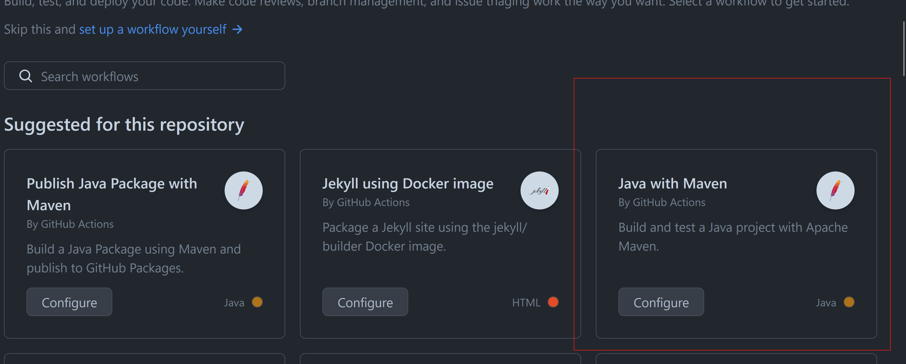
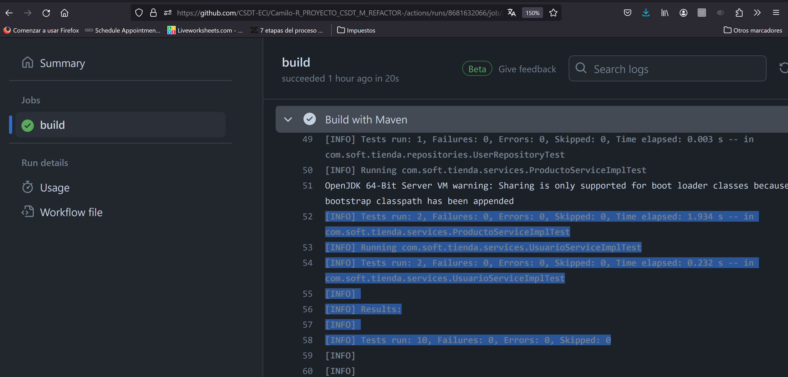
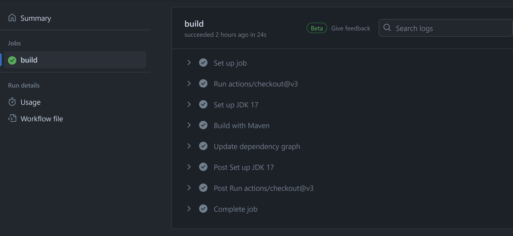
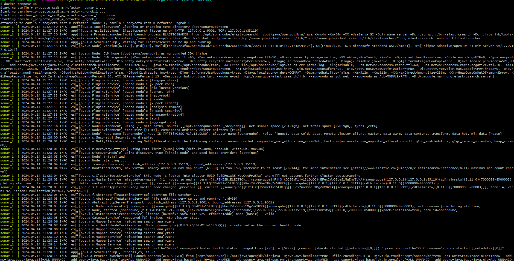
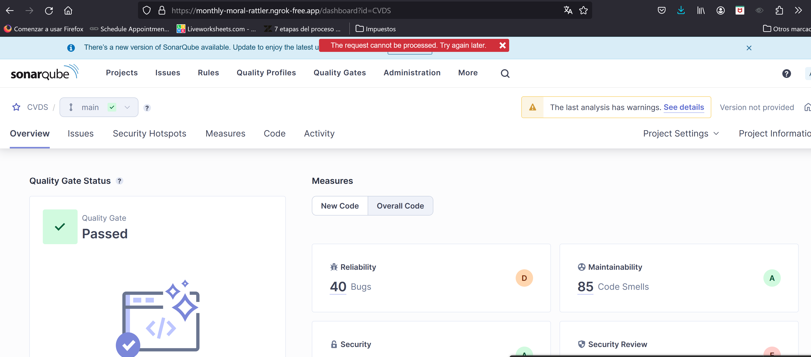
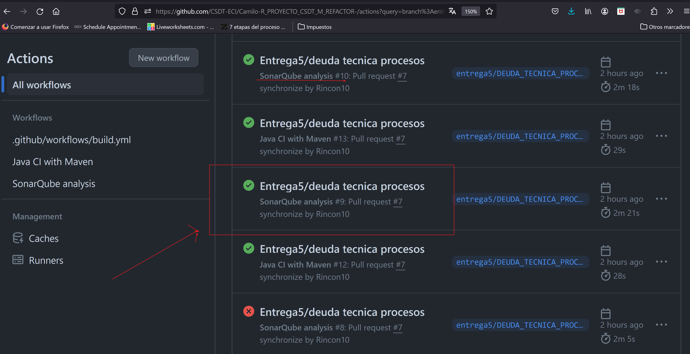
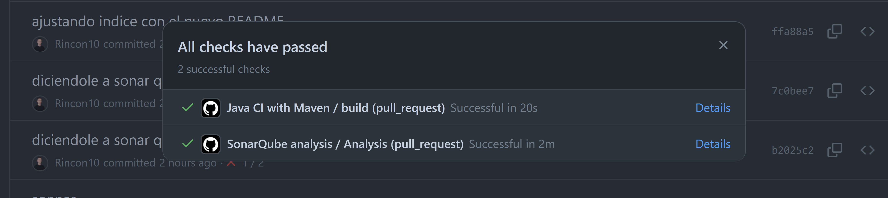

# Deuda técnica en procesos

En esta entrega empezaremos a automatizar los controles de calidad del software, para obtener de manera temprana feedback y no subir malas practicas al repositorio, entre estas nos encontramos con analisis de codigo estatico, cobertura de pruebas y analisis de dependencias.


## Entrega 


### Configurar un proceso de IC utilizando github actions con steps que incluyan mínimo:
* Build
* Unit test

Como lo mencionamos en la entrega anterior, al tener problemas de permisos dentro de la organización, no fue posible integrar sonnarCloud; era ideal lograrlo ya que con este podriamos evidenciar que cada vez que se realizara un PR este nos mencionara que porcentaje de issues y demas metricas estabamos teniendo segun el codigo a integrar .


Para garantizar crear flujos automatizados nos basaremos en las plantillas que nos proporciona github, para esto nos iremos a actions y elegiremos la plantilla de maven con java.

<br/>

<br/>

la cual modificaremos de la siguiente manera para que nos funcione en nuestro proyecto

```yml
# This workflow will build a Java project with Maven, and cache/restore any dependencies to improve the workflow execution time
# For more information see: https://docs.github.com/en/actions/automating-builds-and-tests/building-and-testing-java-with-maven

# This workflow uses actions that are not certified by GitHub.
# They are provided by a third-party and are governed by
# separate terms of service, privacy policy, and support
# documentation.

name: Java CI with Maven

on:
  push:
    branches: [ "master" ]
  pull_request:
    branches: [ "master" ]

jobs:
  build:

    runs-on: ubuntu-latest

    steps:
    - uses: actions/checkout@v3
    - name: Set up JDK 17
      uses: actions/setup-java@v3
      with:
        java-version: '17'
        distribution: 'temurin'
        cache: maven
    - name: Build with Maven
      run: mvn -B package --file Proy_SoftTienda/pom.xml

    
```

Para hacer una prueba haremos un pequeño cambio y lo subiremos a nuestro repositorio remoto, para validar que cada vez que hagamos un pr o un push el workflow se active, en este caso compilaría el proyecto y además correría las pruebas de unidad y con ayuda de la configuración del pom de JaCoCo que explicamos en la anterior entrega el validaría la cobertura del proyecto

<br/>

<br/>


En el PR veremos el siguiente informe, el cual nos especificara los pasos que configuraramos en el workflow

<br/>

<br/>

<br/>

<br/>

* Code Analysis (Reportando en Sonar)

Aun con los temas de permisos con sonarCloud logre integrar sonarqube y github de tal manera que cada vez que se haga un PR se ejecute el análisis de sonarqube en un servidor externo que lo redirige a mi local.


para esto se realizaron las siguiente configuraciones

se utiliza docker compose para configurar la imagen de docker respectiva para utilizar sonarqube, en esta se le configura volumenes para no perder la configuracion una vez se baje el contenedor y ademas se relaciona con la imagen de ngrok la cual es la que redirige las peticiones de un servidor expuesto a intenernet al url que le configuremos
```yml
services:
  sonar:
    image: sonarqube:10.3-community
    volumes:
      - sonarqube_data:/opt/sonarqube/data
      - sonarqube_logs:/opt/sonarqube/logs
      - sonarqube_extensions:/opt/sonarqube/extensions
    environment:
      - SONAR_ES_BOOTSTRAP_CHECKS_DISABLE=true
    ports:
      - 9000:9000
    networks:
      - sonar
  ngrok:
    image: ngrok/ngrok:latest
    environment:
      - NGROK_AUTHTOKEN=${{ secrets.NGROK_AUTHTOKEN }}
    command:
      - "start"
      - "--all"
      - "--config"
      - "/etc/ngrok.yml"
    ports:
      - 4040:4040
    volumes:
      - ./ngrok.yml:/etc/ngrok.yml
    networks:
      - sonar

networks:
  sonar:

volumes:
  sonarqube_data:
    external: false
  sonarqube_logs:
    external: false
  sonarqube_extensions:
    external: false
```

configuracion de ngrok

```yml
version: 2
tunnels:
  sonar:
    addr: http://sonar:9000
    proto: http
    schemes:
      - https
      - http
    domain: monthly-moral-rattler.ngrok-free.app
```

con la anterior configuracion, decimos que toda peticion que se haga al dominio monthly-moral-rattler.ngrok-free.app, la redirija al servidor local con el que estoy corriendo mi servidor 

por ultimo por medio de un properties configuraremos el sonar local

```properties
sonar.projectKey=CVDS
sonar.token=${{ secrets.SONAR_TOKEN }}
sonar.sources=Proy_SoftTienda/src
```

una vez con esta configuracion dejaremos en ejecucion localmente los compose creados con el siguiente comando

```docker
docker-compose up
```
validamos que se suban ambas instancias


<br/>

<br/>

como se puede ver en la siguiente imagen se logra acceder a sonar al servidor remoto que se encuentra en https://monthly-moral-rattler.ngrok-free.app/dashboard?id=CVDS


<br/>

<br/>

ya con esto ajustamos el workflow de sonar de la siguiente manera

```yml
name: SonarQube analysis
on:
  push:
    branches: [ "master" ]
  pull_request:
    branches: [ "master" ]
  workflow_dispatch:
jobs:
  Analysis:
    runs-on: ubuntu-latest
    steps:
      - uses: actions/checkout@v4
        with:
          fetch-depth: 0
      - name: Set up JDK 17
        uses: actions/setup-java@v3
        with:
          java-version: '17'
          distribution: 'temurin'
          cache: maven
      - name: Build with Maven
        run:
          mvn -B package --file Proy_SoftTienda/pom.xml
      - name: Analyze with SonarQube
        uses: SonarSource/sonarqube-scan-action@v2.0.1
        env:
          SONAR_TOKEN: ${{ secrets.SONAR_TOKEN }}   # Generate a token on SonarQube, add it to the secrets of this repo with the name SONAR_TOKEN (Settings > Secrets > Actions > add new repository secret)
          SONAR_HOST_URL: ${{ secrets.SONAR_HOST_URL }}   # Add the URL of your instance to the variables of this repo with the name SONAR_HOST_URL (Settings > Secrets > Actions > add new repository secret)
          SONAR_PROJECT_BASE_DIR: ${{ github.workspace }}/Proy_SoftTienda
          SONAR_SCANNER_OPTS: -Dsonar.java.binaries=Proy_SoftTienda/target/classes
```

por ultimo realizamos un cambio y validamos que el workflow se ejecute

<br/>

<br/>


workflows corriendo 

<br/>

<br/>

```
NOTA: los ultimos commits me dejaron de funcionar porque el servidor remoto tiene limite de peticiones jaja

your account Camilo Rincon has exceeded 100% of its free ngrok bandwidth limit. Traffic to your endpoints will be rejected until your limits reset on May 1, 2024, or until you upgrade to a paid plan.
```


Incluir algún step adicional que consideren pueden generar valor para su proyecto, por ejemplo: ChatOps (Teams, slack), bot de github, Owasp, dependecy check, AI. Bienvenida la imaginación.
Documentar en la bitácora del proyecto


al step del build se le agrega un paso el cual permite revisar las dependencias para lanzar alertas en caso que existan por medio del Dependabot de github 

```yml
# Optional: Uploads the full dependency graph to GitHub to improve the quality of Dependabot alerts this repository can receive
- name: Update dependency graph
  run: mvn com.github.ferstl:depgraph-maven-plugin:4.0.1:graph --file Proy_SoftTienda/pom.xml

```


