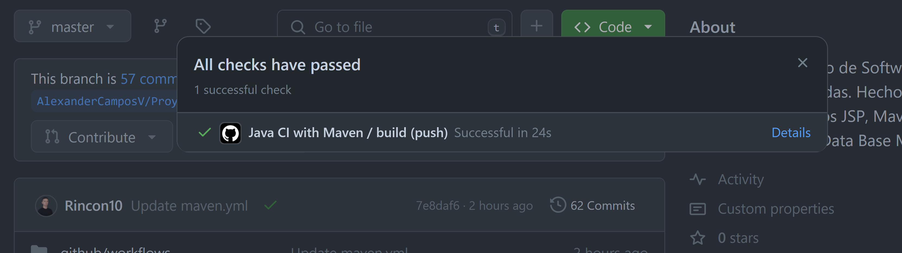

# Deuda técnica en procesos


## Entrega 

En el proyecto del curso:

### Configurar un proceso de IC utilizando github actions con steps que incluyan mínimo:
* Build
* Unit test

Como lo mencionamos en la entrega anterior, al tener problemas de permisos dentro de la organización, no fue posible integrar sonnarCloud  de tal manera que cada vez que se realizara un PR nos mencionara que porcentaje de issues teníamos al estar integrando el codigo.

Para garantizar crear flujos automatizados nos basaremos en las plantillas que nos proporciona github, para esto nos iremos a actions y elegiremos la plantilla de maven con java.

<br/>

<br/>

la cual modificaremos de la siguiente manera para que nos funcione en nuestro proyecto

```yml
# This workflow will build a Java project with Maven, and cache/restore any dependencies to improve the workflow execution time
# For more information see: https://docs.github.com/en/actions/automating-builds-and-tests/building-and-testing-java-with-maven

# This workflow uses actions that are not certified by GitHub.
# They are provided by a third-party and are governed by
# separate terms of service, privacy policy, and support
# documentation.

name: Java CI with Maven

on:
  push:
    branches: [ "master" ]
  pull_request:
    branches: [ "master" ]

jobs:
  build:

    runs-on: ubuntu-latest

    steps:
    - uses: actions/checkout@v3
    - name: Set up JDK 17
      uses: actions/setup-java@v3
      with:
        java-version: '17'
        distribution: 'temurin'
        cache: maven
    - name: Build with Maven
      run: mvn -B package --file Proy_SoftTienda/pom.xml

    
```

Para hacer una prueba haremos un pequeño cambio y lo subiremos a nuestro repositorio remoto, para validar que cada vez que hagamos un pr o un push el workflow se active, en este caso compilaría el proyecto y además correría las pruebas de unidad y con ayuda de la configuración del pom de JaCoCo que explicamos en la anterior entrega el validaría la cobertura del proyecto

<br/>

<br/>


y en el pr veremos el siguiente informe, el cual nos especificara los pasos que configuraramos en el workflow

<br/>

<br/>

<br/>

<br/>

* Code Analysis (Reportando en Sonar)
  sin embargo logre integrar sonarque y github de tal manera que cada vez que se haga un pr se ejecute el analisis de sonarqu en un servidor externo que lo re dirige a mi local.


Incluir algún step adicional que consideren pueden generar valor para su proyecto, por ejemplo: ChatOps (Teams, slack), bot de github, Owasp, dependecy check, AI. Bienvenida la imaginación.
Documentar en la bitácora del proyecto

