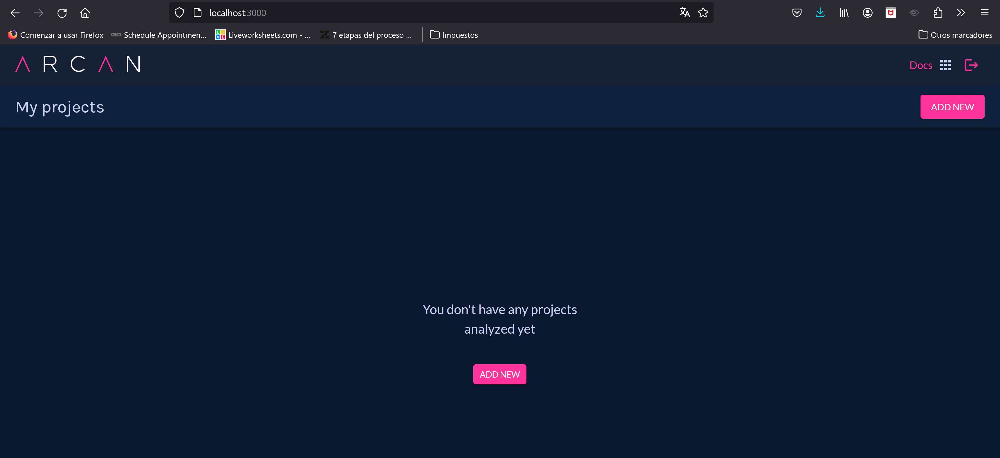

# Arquitectural Smells

## Integrando Sonnar Cloud en el proyecto

## Arcan

Arcan es una herramienta que nos permite 

seguiremos los pasos descritos en el siguiente [tutorial](https://docs.arcan.tech/2.9.0/get_started/), en caso de tener problemas de acceso utilizar una vpn de USA o revisar el [Repositorio publico  arcan](https://github.com/Arcan-Tech/arcan-trial/tree/main).

subimos docker-desktop y ejecutamos el siguiente comando en la carpeta de arcan descargada según el tutorial.


```bash
docker-compose -f docker-compose.yml --env-file .env up
```

verificamos que inicie la creacion de imagenes
<br/>

<br/>

ahora en nuestro navegador abriremos le puerto 3000 y si todo esta bien configurado veremos la siguiente pantalla

<br/>

<br/>

### proyecto original

arquitectura inicial

<br/>

<br/>

Configuramos arcan para que haga un análisis del  proyecto original y nos encontramos con esta métrica de rigidez, que nos menciona que tan difícil puede ser intentar hacer un cambio en el proyecto, lo cual entre más alto se encuentre peor será

<br/>

<br/>

Además, esta herramienta nos permite ver un gráfico de dependencia entre las clases


<br/>

<br/>

Como podemos observar en el anterior gráfico, aunque pareciera que la lógica del código se encuentre separada por servicios, el % de dependencia es muy alto y en caso de añadir nuevas funcionalidades puede ser muy costoso y se deba hacer un reproceso de refactorización de código

### proyecto atacando deudas tecnicas y refactoring 

Arquitectura propuesta

<br/>

<br/>

configuramos arcan para que haga un análisis del  proyecto que hemos venido trabajando y como podemos observar la metrica de rigidez disminuyo y puede disminuir más ya que no se terminaron todos los componentes de la arquitectura propuesta

<br/>

<br/>

grafico de dependencia entre las clases

<br/>

<br/>

en apoyo de el indicador de dependencia, podemos ver que se mantiene la separacion de responsabilidades pero con los cambios se puede llegar a realizar cambios y/o inyeccion de funcionalidades de una manera más transparente

## Utilizando Designite 

Para detectar posibles problemas de la arquitectura, diseño e implementación que presenta un proyecto, no podemos apoyar de la herramienta DesigniteJava, ya que esta permite realizar una evaluación de calidad de código escrito en java en los aspectos antes mencionados. 

Además,  calcula muchas métricas orientadas para visualizar la deuda técnica, empezaremos instalandola siguiendo [los pasos de su pagina oficial](https://www.designite-tools.com/docs/getting_started.html).

posteriormente ejecutaremos el siguiente comando

```bash
java -jar DesigniteJava.jar -i <path of the input source folder> -o <path of the output folder>

java -jar DesigniteJava.jar -i C:\proyectos\Camilo-R_PROYECTO_CSDT_M_REFACTOR-\Proy_SoftTienda\src -o C:\proyectos\Camilo-R_PROYECTO_CSDT_M_REFACTOR-\report_designite
```


nos encontraremos unos archivos csv, los cuales no mencionaran designCodeSmells 

| Project Name   | Package Name    | Type Name             | Code Smell           |
|----------------|-----------------|-----------------------|----------------------|
| Proy_SoftTienda | com.soft.tienda | ClienteController     | Unutilized Abstraction |
| Proy_SoftTienda | com.soft.tienda | Controlador           | Unutilized Abstraction |
| Proy_SoftTienda | com.soft.tienda | ProductoController    | Unutilized Abstraction |
| Proy_SoftTienda | com.soft.tienda | ProveedorController   | Unutilized Abstraction |
| Proy_SoftTienda | com.soft.tienda | ServletInitializer    | Unutilized Abstraction |
| Proy_SoftTienda | com.soft.tienda | SwaggerConfig         | Unutilized Abstraction |
| Proy_SoftTienda | com.soft.tienda | UsuarioController     | Unutilized Abstraction |
| Proy_SoftTienda | com.soft.tienda | VentaController       | Unutilized Abstraction |
| Proy_SoftTienda | com.soft.tienda.DTO | DetalleVenta     | Unutilized Abstraction |
| Proy_SoftTienda | com.soft1.tienda | SoftTiendaApplicationTests | Unutilized Abstraction |

Como podemos observar en el anterior reporte todos los smells de diseño, se encuentran en que existen clases, interfaces o metodos que no se utilizan en ninguna parte del codigo, con estasa identificaciones podemos buscarlas con ayuda de otras herramientas para garantizar la claridad y mantenibilidad del codigo

ahora realizaremos un analisis segun los codeSmells de la implmentacion del proyecto original

| Project Name   | Package Name              | Type Name          | Method Name               | Code Smell     |
|----------------|---------------------------|--------------------|---------------------------|----------------|
| Proy_SoftTienda | com.soft.tienda.config   | SwaggerConfig      | apiDocket                 | Long Statement |
| Proy_SoftTienda | com.soft.tienda.config   | SwaggerConfig      | getApiInfo                | Long Statement |
| Proy_SoftTienda | com.soft.tienda.services | ProductoServiceImpl | findAll                   | Long Statement |
| Proy_SoftTienda | com.soft.tienda.services | ProductoServiceImpl | findById                  | Long Statement |
| Proy_SoftTienda | com.soft.tienda.services | ProductoServiceImpl | findById                  | Long Statement |
| Proy_SoftTienda | com.soft.tienda.services | ProductoServiceImpl | addProduct                | Long Statement |
| Proy_SoftTienda | com.soft.tienda.services | ProductoServiceImpl | deleteById                | Long Statement |
| Proy_SoftTienda | com.soft.tienda.services | ProductoServiceImpl | deleteById                | Long Statement |
| Proy_SoftTienda | com.soft.tienda.services | ProductoServiceImpl | updateProduct             | Long Statement |
| Proy_SoftTienda | com.soft.tienda.services | ProductoServiceImpl | updateProduct             | Long Statement |
| Proy_SoftTienda | com.soft.tienda.services | UsuarioServiceImpl  | consultarUsuarioPorCorreoElectronico | Long Statement |
| Proy_SoftTienda | com.soft.tienda.services | ProductoServiceImplTest | testUpdateProductSuccess | Magic Number   |
| Proy_SoftTienda | com.soft.tienda.services | ProductoServiceImplTest | testUpdateProductFailure | Magic Number   |

gracias a este reporte podemos mencionar lo siguiente:

- Posiblemente en el codigo fuente tiene un parametro numerico que en lugar de haber sido asignado en una variable con un nombre descriptivo, se coloco de manera literal. cauando problemas de mantenibilidad 
- Existen varios metodos que nos da una alerta ya que pueden excesivamente largos, posiblemente en una no seperacion de responsabilidades de manera correcta

### Referencias 

- CAST Highlight - Rapid Application Portfolio Analysis (castsoftware.com)
- [Arcan](https://docs.arcan.tech/2.9.0/installation/)
- [Designite - Reduce Technical Debt of your Software](https://www.designite-tools.com/docs/getting_started.html)

- A Taxonomy of Software Smells (tusharma.in)

- https://www.opengroup.org/architecture/togaf7-doc/arch/p4/comp/clists/syseng.htm
- https://docs.microsoft.com/en-us/previous-versions/msp-n-p/ff647464(v=pandp.10)?redirectedfrom=MSDN
- https://sonarcloud.io/