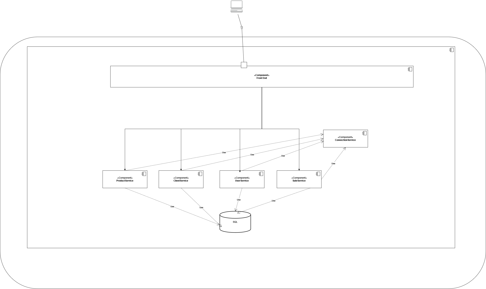
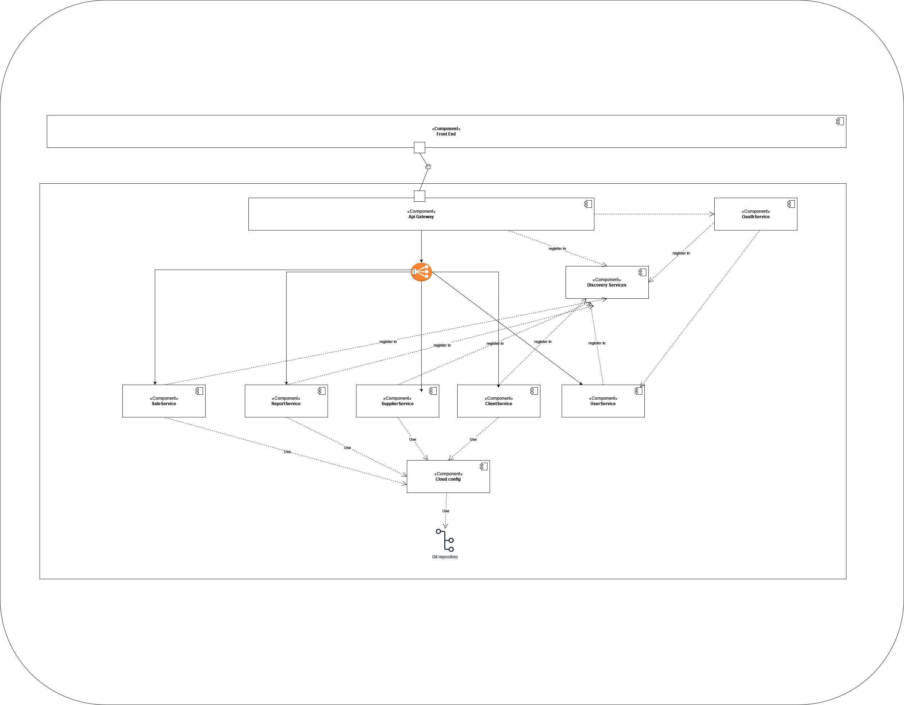
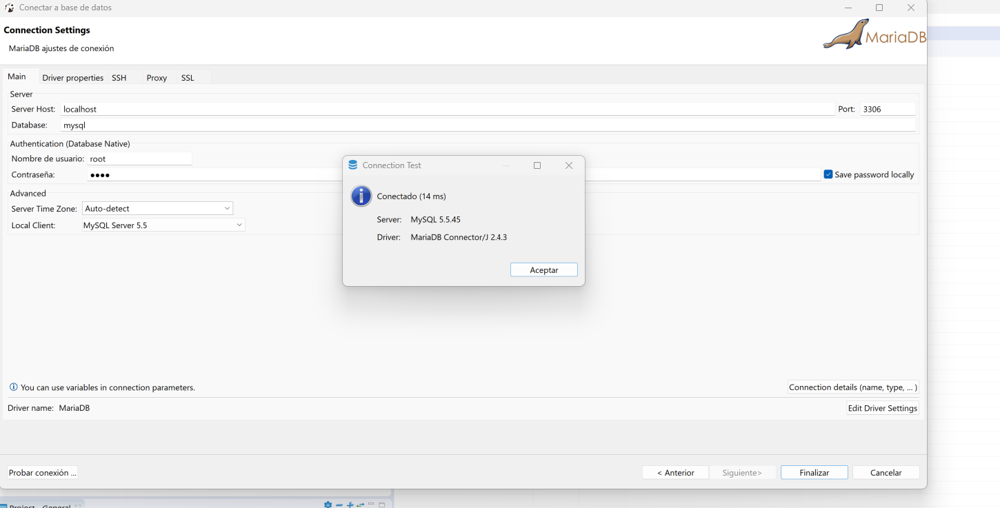

# SoftTienda
SofTienda. Es una aplicación web con arquitectura monolítica, la cual le permite llevar una gestión de ventas de un negocio, en este aplicativo se permite tener un registro de sus clientes, usuarios y proveedores actuales, en conjunto también se permite llevar un control de ventas generando una factura y a través de esta generar reportes, esto con el fin de dar cierta visibilidad de al usuario final de como van las ventas.    

## Empezando

### Autor repositorio base 
- Alexander Campos - AlexanderCamposV - [SoftTienda](https://github.com/AlexanderCamposV/Proyecto-CRUD-Monolito-Java-SpringBoot-MariaDB)

### Arquitectura de Alto nivel inicial

<br/>

<br/>


### Arquitectura de Alto nivel refactor
<br/>

<br/>

### Tecnologias 

- SpringBoot
- JQuery

### Pre-requisitos

- Java 11
- MariaDB
- Docker (para futuras implementaciones)

### Ejecutando Aplicación

En caso de no tener configurado la db de MariaDB, podemos utilizar docker para configurarla, para eso ejecutar los siguientes comandos
```bash
docker pull mariadb
docker volume create data
docker run --detach --name mariadb -p 3306:3306 -v data:/var/lib/mysql --env MARIADB_ROOT_PASSWORD=root --env MARIADB_DATABASE=mysql  mariadb:latest
```

validamos que la conexion se pueda hacer

<br/>

<br/>